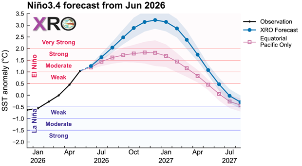
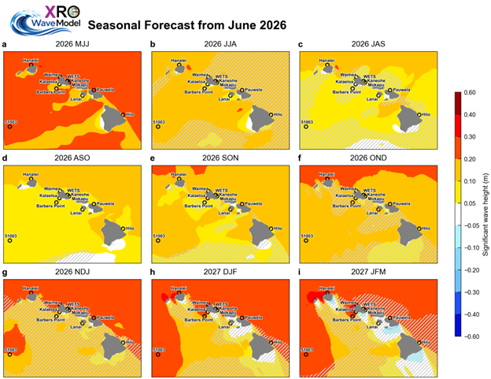
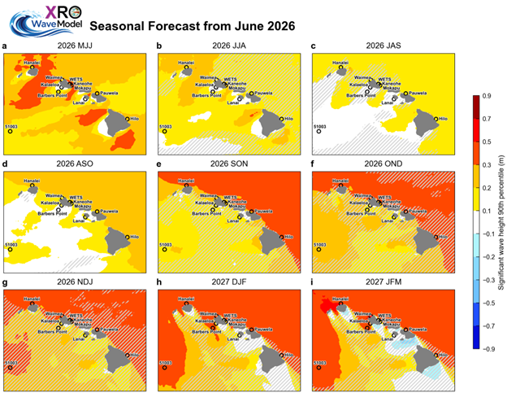

  <h1>ENSO Forecast and Hawaii Wave Seasonal Outlook</h1>

June 2026

<h2>Seasonal ENSO Forecast</h2>

El Niño conditions are currently intensifying across the tropical Pacific, with SST anomalies in the Niño3.4 region (5°S–5°N, 120°–170°W) showing a steady upward trend. The observed SST anomaly reached 1.04°C in May 2026, placing a moderate El Niño level. Our XRO forecast Niño3.4 anomalies exceeding +2.0°C by Jul-Sep 2026, providing a high level of confidence in development of a super El Niño event characterized by significant warming in the central and eastern tropical Pacific (Figure 1).

Figure 1. Seasonal ENSO forecasts based on the Niño3.4 sea surface temperature (SST) anomalies (120-170W, 5S-5N, °C) from June 2026 using the XRO (blue). The red curve represents the forecast generated without considering pantropical interactions from the Extratropical Pacific, Indian, and Atlantic Oceans.

<h2>Hawaii Wave Seasonal Outlook</h2>

The development of a strong-to-very-strong El Niño is expected to substantially modulate significant wave height (SWH) around the Hawaiian Islands over the coming seasons. Figures 2 and 3 show forecasts of seasonal mean and 90th-percentile SWH anomalies, respectively, from June 2026 through early 2027. Positive SWH anomalies, indicative of enhanced wave activity, are already emerging along north- and northwest-facing shores in MJJ–JJA 2026. These seasonal anomalies are expected to intensify progressively through boreal fall and winter as El Niño matures. The largest positive anomalies could exceed +0.3 m in mean SWH and +0.6 m in the 90th percentile for NDJ 2026 through JFM 2027. 

The projected increase in wave heights around Hawaii is consistent with a strengthened North Pacific jet stream, an equatorward-shift of the storm track, and enhanced high-latitude swell generation, all of which are characteristics of strong El Niño winters (Stopa & Cheung, 2014; Zhao et al. 2025). In contrast, outlooks for south- and southeast-facing shores indicate weaker or near-neutral anomalies throughout the forecast period, although the forecast skill in these regions is comparatively lower. 

Figure 2. Seasonal mean significant wave height anomaly outlook issued in June 2026 from the XROWaveModel. Hatched areas denote regions where the corresponding hindcast anomaly correlation coefficient (ACC) evaluated over the 1980–2024 period, is below 0.5, suggesting reduced forecast skill and lower confidence in the predicted anomalies.

Figure 3. Outlook of seasonal 90th percentile significant wave height anomalies (m) issued in June 2026 from the XROWaveModel. Hatched areas denote regions where the corresponding hindcast anomaly correlation coefficient (ACC) evaluated over the 1980–2024 period, is below 0.5, suggesting reduced forecast skill and lower confidence in the predicted anomalies.

<h2>Disclaimer</h2>

This experimental product is provided for informational and academic research purposes and is not intended for production use. While derived from validated statistical frameworks, the inherent stochasticity of the climate system introduces uncertainty. This website and its affiliated entities expressly disclaim any liability for decisions or actions based on the reliance on this information. Furthermore, no responsibility is assumed for any consequential, special, or similar damages resulting from such reliance.

<h2>References:</h2>

Stopa, J. E., & Cheung, K. F. (2014). Periodicity and patterns of ocean wind and wave climate. Journal of Geophysical Research: Oceans, 119(8), 5563–5584. https://doi.org/10.1002/2013JC009729

Zhao, S., Li, N., Jin, F.-F., Cheung, K. F., & Yang, Z. (2025). Contrast and Predictability of Island-Scale El Niño Influences on Hawaii Wave Climate. Geophysical Research Letters, 52(8), e2024GL113127. https://doi.org/10.1029/2024GL113127

